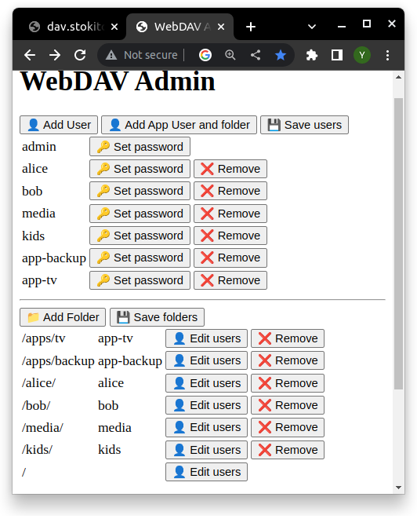

# openwrt-lighttpd-public
OpenWrt configuration for Lighttpd with WebDAV and autosharing from USB disk.
The work in progress and the instruction is incomplete.

See [OpenWrt Wiki: WebDAV Share](https://openwrt.org/docs/guide-user/services/nas/webdav)



## Installation

Copy files to router and execute the install.sh.

We need to remove config files for modules of main lighttpd instance because they'll break lighttpd
* /etc/lighttpd/conf.d/30-simple_vhost.conf
* /etc/lighttpd/conf.d/30-webdav.conf

But during an upgrade just a new version will be put there,
So instead of removing we need to override them.


Then add this to `/etc/config/firewall`:

```
config redirect
	option dest_port '2080'
	list proto 'tcp'
	option src_dport '80'
	option dest 'lan'
	option src 'wan'
	option target 'DNAT'
	option dest_ip '192.168.1.1'
	option name 'wan-http-to-local-2080'

config redirect
	option dest_port '2443'
	list proto 'tcp'
	option name 'wan-https-to-local-2443'
	option src_dport '443'
	option dest 'lan'
	option dest_ip '192.168.1.1'
	option src 'wan'
	option target 'DNAT'
```
Then reload the firewall: `/etc/init.d/firewall reload`

Add automount for USB into `/etc/config/fstab`: 
```
config mount
	option enabled '1'
	option target '/mnt/autoshare'
	option label 'AUTOSHARE'
```

### Configure HTTPS
If you are going to use the WebDAV share from internet then you need to enable HTTPS with TLS encryption.
The TLS certificates path needs to be configured in `/etc/lighttpd-public/conf.d/90-tls_cert_custom.conf`
Here in samples is configured acme.sh with DuckDNS.org domain.
See https://openwrt.org/docs/guide-user/services/tls/certs

## See also
* [Lighttpd mod_simple_vhost](https://redmine.lighttpd.net/projects/lighttpd/wiki/Mod_simple_vhost)
* [Lighttpd mod_webdav](https://redmine.lighttpd.net/projects/lighttpd/wiki/Mod_webdav)
* [Lighttpd mod_auth](https://redmine.lighttpd.net/projects/lighttpd/wiki/Mod_auth)
* [WebDAV Browser plugin](https://github.com/WebDAVDevs/webdav-browser-extension)
* [Awesome WebDAV: list of software and articles](https://github.com/WebDAVDevs/awesome-webdav/)
